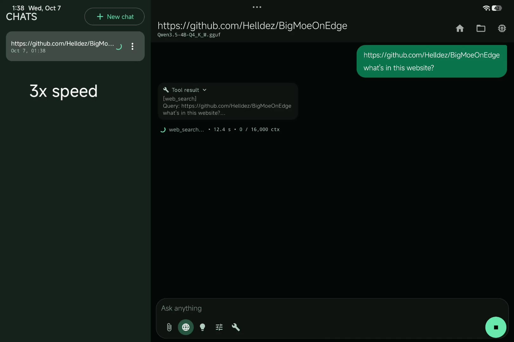
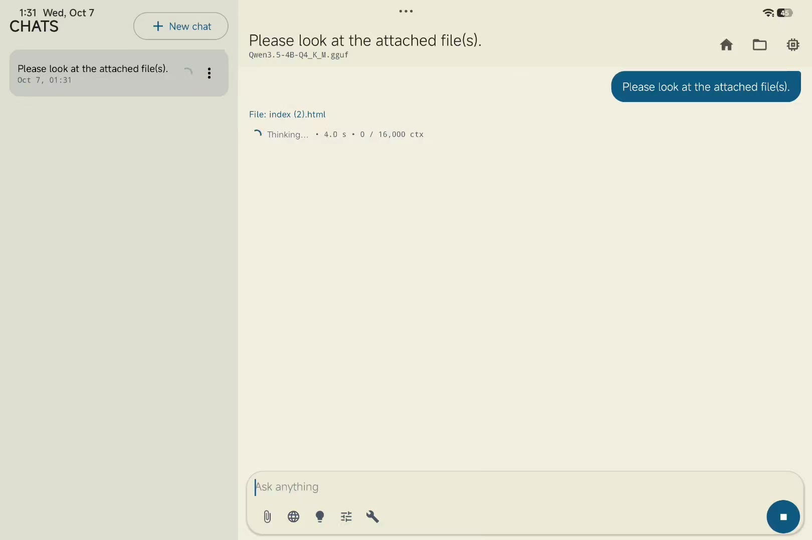
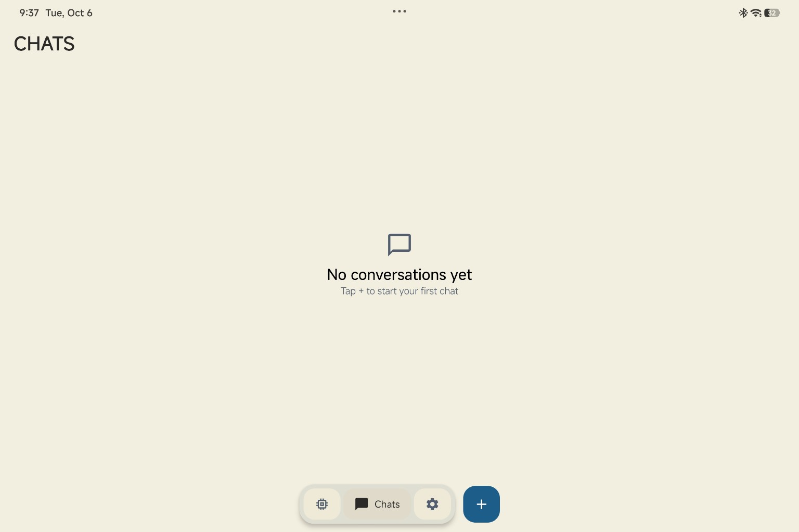

<p align="center">
  
</p>

<h1 align="center">BigMoeOnEdge+</h1>

<p align="center">
  A full-featured local AI chat app for Android, built around the BigMoeOnEdge engine.
</p>

<p align="center">
  <a href="https://github.com/hamodexd217/BigMoeOnEdge-plus/releases/latest">Download</a>
  ·
  <a href="https://github.com/hamodexd217/BigMoeOnEdge-plus/issues">Issues</a>
  ·
  <a href="docs/STATUS.md">Project status</a>
</p>

<p align="center">
  
  
  
</p>

---

## What is BigMoeOnEdge+?

**BigMoeOnEdge+** is an Android client built on top of [BigMoeOnEdge](https://github.com/Helldez/BigMoeOnEdge), with a larger application layer around it for day-to-day local AI use.

The idea is simple: instead of having a minimal model runner, BigMoeOnEdge+ tries to bring the pieces people expect from a modern AI client into one on-device app — persistent chats, reasoning, web search, tools, attachments, vision, artifacts, a workspace, and generation telemetry.

The current project vendors **BigMoeOnEdge 0.28.0** and applies project-specific patches on top of it.

> **Reality check:** local inference on Android is not instant magic. Large models can be genuinely slow, especially on mobile hardware. Web search and tool calls can add additional network/model-processing time. Some feature tests in this project intentionally use a smaller model just to shorten the test cycle; those runs are feature checks, not large-model benchmarks.

## Demo

### Artifacts


### Web search

[](docs/assets/demo-web-search.mp4)

### File attachments

[](docs/assets/demo-attachments.mp4)

## Screenshots

### Chats

<p align="center">
  
</p>

### Models

<p align="center">
  
</p>

## Features

| Area | Included |
| --- | --- |
| Local inference | GGUF models through the native BigMoeOnEdge engine |
| Model support | MoE and regular dense models with automatic detection |
| Conversations | Persistent Room-backed chats |
| Reasoning | Streaming Thinking / reasoning UI |
| Web | Web search integrated into chat |
| Tools | File, code, web and utility tools with approval flow |
| Attachments | Text, code, archives, documents, images and video |
| Vision | Multimodal `mmproj` support |
| Artifacts | HTML, SVG, Mermaid, Markdown and source-code artifacts |
| Workspace | Browse, open, edit, save, copy, share and download files |
| Code blocks | Language detection, syntax highlighting and copy-code actions |
| Message actions | Edit and copy messages |
| Telemetry | Tokens/s, prefill and cache-related generation stats |
| Settings | Context, sampling, expert-cache, tools and media controls |
| Wide screens | Persistent chat-history panel |
| Optional acceleration | Separate Hexagon/NPU build path for supported Snapdragon environments |

## Models

BigMoeOnEdge+ loads `.gguf` models directly on the device.

A few models used during development include:

- Qwen3.5 4B Q4
- Qwen3.5 9B Q5
- Qwen3.6 35B-A3B Q4 MTP

These are examples, not a hardcoded supported-model list. MoE and dense models are detected automatically and loaded through their appropriate path.

For multimodal models, the model and its `mmproj` projector can be imported separately.

### Performance

There is no single speed number that represents the app.

Actual generation speed depends on the model, quantization, context size, storage speed, cache configuration, temperature, and the device. Very large MoE models can take a long time to generate.

Likewise, **web search, tool use, attachments, reasoning and artifact generation can take noticeably longer than plain text generation** because they may require extra model work, file processing, rendering, or network requests.

When looking at demonstrations in this repository, check which model was used before treating the result as a performance benchmark.

## Download

The latest release is available here:

**[Download the latest APK](https://github.com/hamodexd217/BigMoeOnEdge-plus/releases/latest)**

Current release: **v0.2.0**

**[Download `BigMoeOnEdge.plus.apk`](https://github.com/hamodexd217/BigMoeOnEdge-plus/releases/download/0.2.0/BigMoeOnEdge.plus.apk)**

## Requirements

### Running

- Android 10 or newer
- Enough RAM and storage for the model you want to load
- A compatible model + `mmproj` for vision features
- Internet access for web search and other network-backed features

### Building

- Android Studio (Koala+)
- Android SDK 35
- JDK 17
- Android NDK
- CMake 3.22.1
- Internet access for the initial Gradle sync

The native engine is compiled in **Release mode even for debug APKs**, because an unoptimized native build is too slow for practical inference.

## Build

```bash
git clone https://github.com/hamodexd217/BigMoeOnEdge-plus.git
cd BigMoeOnEdge-plus

./gradlew assembleDebug
```

The normal build targets `arm64-v8a`.

For `arm64-v8a` + `x86_64`:

```bash
./gradlew assembleDebug -PbmoeAbis=arm64-v8a,x86_64
```

JVM unit tests:

```bash
./gradlew testDebugUnitTest
```

Android instrumentation tests require a connected device or emulator:

```bash
./gradlew connectedDebugAndroidTest
```

The first native build is much heavier than a typical Compose app because it compiles the native inference stack as well.

## Loading a model

1. Open **Models**.
2. Tap **Choose `.gguf` (model or mmproj)**.
3. Pick the model or projector.
4. Load it.

The app copies imported model files into app-private storage because the native engine needs a real filesystem path.

For debug builds, models can also be pushed with `adb` into the app's model directory and then refreshed from the Models screen.

## Vision and video

Vision-capable models use an `mmproj` projector.

The app supports importing the projector separately, discovering projector candidates, and selecting the correct projector during model loading.

Image/video behavior still depends on the exact model + projector + device combination. Video input is processed from sampled visual frames rather than being treated as a continuous raw video stream by the model.

## Web search and tools

BigMoeOnEdge+ includes web search and an expanding tool layer for file/code/web/utility tasks.

These features are intentionally not presented as “free” computation:

- Web search needs a network connection.
- Search can be slow because it includes network latency and model processing.
- Tool calls can trigger additional reasoning and file processing.
- Large models may make a simple tool-enabled task take considerably longer.

That trade-off is real, and the README does not hide it.

## Artifacts and workspace

Generated code and files can become real artifacts instead of disappearing into chat text.

Supported behavior includes:

- HTML / SVG / Mermaid live previews
- Rendered Markdown
- Highlighted source-code artifacts
- Copyable code
- Offline JavaScript execution when explicitly requested
- Workspace browsing and file management
- Copy / share / download actions

Common languages such as Kotlin, Java, Python, C/C++, JavaScript/TypeScript, JSON, YAML, shell, Dockerfile and SQL are preserved as code artifacts.

The app does **not** bundle a general Python or system interpreter, so Python and similar languages are not executed as arbitrary native programs.

## File and archive attachments

The attachment layer supports more than plain text. Current handling includes ZIP/JAR, TAR, GZ/TAR.GZ and several zipped document formats such as DOCX, XLSX, PPTX, ODT/ODS/ODP and EPUB.

Large files can take time to prepare. The app applies bounded reading limits when extracting archive/document contents rather than blindly loading an entire archive into memory.

## Native architecture

```text
Compose UI
   ↓
Chat / Generation / Agent controllers
   ↓
EngineController
   ↓
EngineBackend
   ↓
JNI bridge
   ↓
BigMoeOnEdge native engine
   ↓
llama.cpp / ggml
```

The project keeps the Android UI layer separated from the native engine so engine changes do not have to leak throughout the app.

## Project structure

```text
app/
  src/main/java/com/bigmoe/onedge/
    core/          engine, generation, model management, context
    parser/        markdown, code fences, artifact languages
    tools/         web, file and utility tools
    data/          Room persistence and settings
    ui/            Jetpack Compose UI
  src/main/cpp/
    core/          vendored BigMoeOnEdge + local patches
    third_party/   vendored llama.cpp

docs/
  STATUS.md
  model-loading.md
  tool-calling.md
  multimodal-feasibility.md
  ...

patches/
scripts/
.github/workflows/
```

## Optional Hexagon / NPU build

The normal build is CPU-focused and does not require the Qualcomm/Hexagon SDK.

A separate GitHub Actions workflow can build an NPU-enabled APK using a pinned Snapdragon toolchain. The app only exposes the NPU switch when the packaged native library actually reports Hexagon support.

This path is deliberately separate so a normal CPU APK does not pretend to have an accelerator that is not present.

## Known limitations

BigMoeOnEdge+ is still an evolving project.

Some current limitations include:

- Performance varies dramatically between models and devices.
- Web search requires network access.
- Multimodal support depends on the exact model and `mmproj` pair.
- Voice input is not part of this project.
- Grammar-constrained tool calls are not part of this project.
- Some multimodal and device-specific behavior still needs more real-device validation.
- Large native builds take significantly longer than ordinary Android app builds.

For the detailed implementation state, test checklist and remaining work, see **[`docs/STATUS.md`](docs/STATUS.md)**.

## Development and transparency

This project has been developed with AI assistance, including code review/implementation help during the extension work. That is part of the project's development story, not something being hidden in release notes.

At the same time, AI-assisted development does not mean every feature is automatically verified. Native builds, model compatibility, multimodal paths, performance and device behavior still require actual testing.

The repository keeps a detailed status document so that “implemented” and “tested on a real device” are not treated as the same thing.

## Credits

BigMoeOnEdge+ builds on:

- [BigMoeOnEdge](https://github.com/Helldez/BigMoeOnEdge)
- [llama.cpp](https://github.com/ggml-org/llama.cpp)
- Jetpack Compose, Room, DataStore and the wider Android ecosystem

Vendored components retain their respective licenses and notices.

## License

BigMoeOnEdge+ is licensed under the **Apache License 2.0**. See [`LICENSE`](LICENSE).

---

<p align="center">
  Built for local AI on Android — with the slow parts left visible instead of hidden.
</p>
