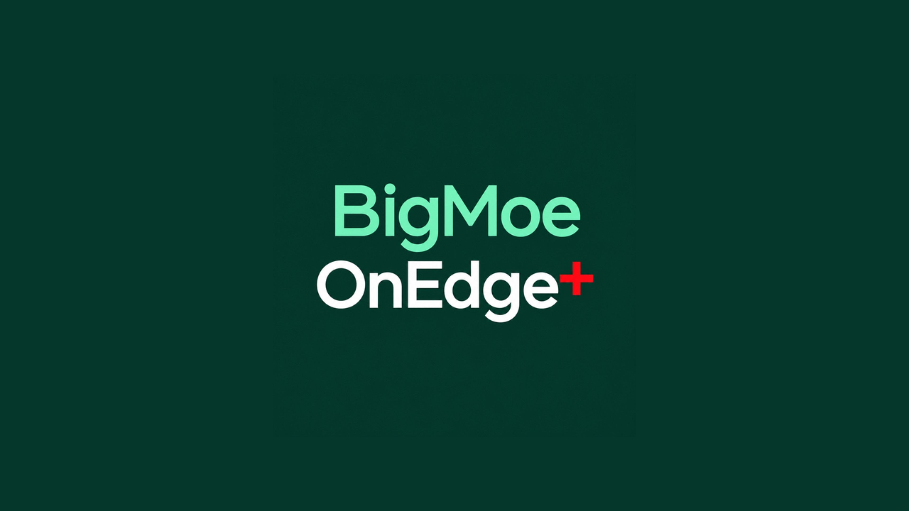
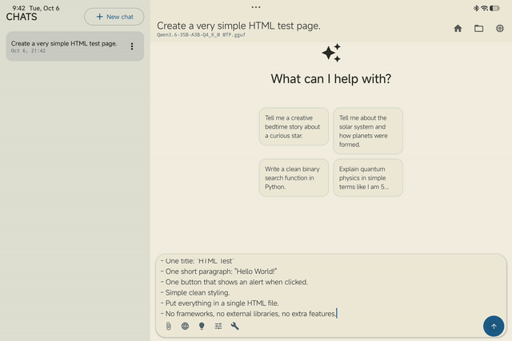
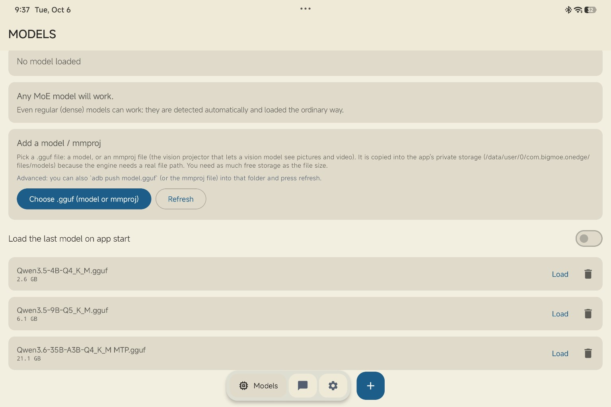

<p align="center">
  
</p>

<h1 align="center">BigMoeOnEdge+</h1>

<p align="center">
  An Android chat app for running local GGUF models on-device, especially large Mixture-of-Experts models.
</p>

<p align="center">
  <a href="https://github.com/hamodexd217/BigMoeOnEdge-plus/releases/latest">Download</a>
  ·
  <a href="https://github.com/hamodexd217/BigMoeOnEdge-plus/issues">Issues</a>
  ·
  <a href="docs/STATUS.md">Project status</a>
</p>

<p align="center">
  <a href="https://github.com/hamodexd217/BigMoeOnEdge-plus/releases"></a>
  <a href="LICENSE"></a>
  <a href="https://github.com/hamodexd217/BigMoeOnEdge-plus/stargazers"></a>
</p>

---

## What is BigMoeOnEdge+?

BigMoeOnEdge+ is an Android chat application built on the **BigMoeOnEdge** native inference engine (version 0.28.0).

The engine is designed for Mixture-of-Experts models whose weights are read from flash storage during generation, which makes models larger than the device's RAM practical to run. The app wraps that engine in a complete chat experience: persistent conversations, reasoning display, web search, tools, attachments, multimodal input, artifacts, a workspace, and generation telemetry.

Dense GGUF models are supported through the normal loading path.

## Demo

A quick look at the artifact workflow:





More screenshots and demo media are in [`docs/assets`](docs/assets).

## Screenshots

<p align="center">
  
</p>

The model manager loads GGUF models and `mmproj` projector files, and detects whether a model is Mixture-of-Experts or dense.

## Highlights

| Area | Details |
| --- | --- |
| Local inference | GGUF models through the native BigMoeOnEdge engine |
| Model support | Mixture-of-Experts and dense models, with automatic detection |
| Conversations | Persistent Room-backed chats, with per-chat drafts |
| Generation | Live token streaming and a stop control |
| Reasoning | Streaming "Thinking" / reasoning display |
| Web | Web search integrated into the chat workflow |
| Tools | File, code, web, and utility tools behind an approval flow |
| Attachments | Text, code, archives, documents, images, and video |
| Vision | `mmproj` support for multimodal models |
| Artifacts | HTML, SVG, Mermaid, Markdown, and highlighted source code |
| Workspace | Browse, open, edit, save, copy, share, and download generated files |
| Chat controls | Edit and copy messages; copy raw code blocks |
| Telemetry | Per-message statistics such as tokens/s, prefill, and cache information |
| Settings | Context, sampling, expert cache, I/O and compute overlap, media, and tool controls |
| Wide screens | Persistent chat-history panel |
| Optional acceleration | Separate Hexagon/NPU build path for supported Snapdragon environments |

## Model support

Load `.gguf` models from the Models screen.

Models used during development include:

- Qwen3.5 4B Q4
- Qwen3.5 9B Q5
- Qwen3.6 35B-A3B Q4 MTP

The app is not limited to these. MoE models are detected automatically, and regular dense GGUF models use the standard loading path. For multimodal models, import the `mmproj` projector separately.

## Performance notes

There is no single "BigMoeOnEdge+ speed" number.

Generation speed depends on the model, quantization, context size, storage speed, cache settings, device hardware, and thermal conditions. Web search and tool use add latency on top of generation.

**I/O and compute overlap:** the Settings screen has an *I/O and compute overlap* switch. When enabled, the engine issues the next weight reads while the current layer is computing, so flash latency is hidden behind the work. Its effect depends on the model and device, so compare tokens/s with the switch on and off on your own hardware.

Some feature tests intentionally use a smaller model so they finish faster. Those tests show that a feature works. They do not represent the performance of a large model.

## Download

The latest release includes an installable Android APK:

**[Download the latest APK](https://github.com/hamodexd217/BigMoeOnEdge-plus/releases/latest)**

Current release: **[BigMoeOnEdge+ v0.2.0](https://github.com/hamodexd217/BigMoeOnEdge-plus/releases/tag/0.2.0)**

The app version (v0.2.0) and the engine version (BigMoeOnEdge 0.28.0) are versioned separately.

## Requirements

### Running the app

- Android 10 or newer
- Enough RAM and storage for the selected model
- A compatible model and `mmproj` file for vision or video input
- A network connection for web search

### Building from source

- Android Studio (Koala or newer)
- Android SDK 35
- JDK 17
- Android NDK
- CMake 3.22.1
- Internet access for the first Gradle dependency sync

Native code is built in **Release mode even for debug APKs**, because an unoptimized native build is too slow for real inference.

## Build

Clone the repository:

```bash
git clone https://github.com/hamodexd217/BigMoeOnEdge-plus.git
cd BigMoeOnEdge-plus
```

Build the default ARM64 debug APK:

```bash
./gradlew assembleDebug
```

Build for ARM64 and x86_64:

```bash
./gradlew assembleDebug -PbmoeAbis=arm64-v8a,x86_64
```

Run JVM unit tests:

```bash
./gradlew testDebugUnitTest
```

Run instrumentation tests on a connected device or emulator:

```bash
./gradlew connectedDebugAndroidTest
```

## Loading models

1. Open **Models**.
2. Tap **Choose `.gguf` (model or mmproj)**.
3. Select the model or projector.
4. Load it.

Models are copied into app-private storage, because the native engine needs a real filesystem path. For debug builds, you can also push models with `adb` into the app's model directory and refresh the Models screen.

## Multimodal models

Vision-capable models use an `mmproj` projector. The app can import the model and projector separately, discover projector candidates, and select the correct one when loading.

Image and video support depends on the exact model, projector, and device. Video is handled as sampled frames, not continuous video understanding.

## Web search and tools

Web search and tools run inside the normal chat workflow.

- Web features need network access.
- Searches and tool calls can take noticeable time.
- Tool execution can require additional model reasoning.
- Large local models make these operations considerably slower.

## Artifacts and workspace

Generated files and code are handled as artifacts instead of plain chat text:

- HTML, SVG, and Mermaid previews
- Rendered Markdown
- Highlighted source-code artifacts
- Copyable code
- Offline JavaScript execution, only when explicitly requested
- Workspace browsing and file management
- Saving, editing, sharing, and downloading files

Common source formats such as Kotlin, Java, Python, C/C++, JavaScript/TypeScript, JSON, YAML, shell, Dockerfile, and SQL are saved as code artifacts. Languages that need an external interpreter, such as Python, are not executed by the app.

## Chat and attachments

Conversations persist through Room. Supported features include:

- Editing and copying messages
- Copying raw code blocks
- Persistent per-chat drafts
- Text and code attachments
- Images and video
- ZIP, JAR, TAR, and GZ archives
- DOCX, XLSX, PPTX, and other supported document formats
- File navigation and workspace operations

Attachment processing uses size limits, so very large files do not silently consume excessive memory.

## Native engine

Native dependencies are vendored rather than pulled in as git submodules.

- `app/src/main/cpp/core`: the vendored BigMoeOnEdge 0.28.0 engine, plus local patches.
- `app/src/main/cpp/third_party/llama.cpp`: the vendored llama.cpp snapshot.
- `EngineNativeBridge.kt`: JNI bridge to the engine.
- `patches/`: project-specific native changes in re-applicable patch form.

The optional Hexagon/NPU path is separate from the default CPU build and requires the Snapdragon toolchain.

## Project structure

```text
app/
  src/main/java/com/bigmoe/onedge/
    core/       engine, generation, model management, context
    parser/     markdown, code fences, artifact languages
    tools/      web, file, and utility tools
    data/       Room persistence and settings
    ui/         Compose UI
  src/main/cpp/
    core/       BigMoeOnEdge engine + local patches
    third_party/llama.cpp
docs/
  STATUS.md
  model-loading.md
  tool-calling.md
  multimodal-feasibility.md
  ...
patches/
scripts/
.github/workflows/
```

## Testing and status

The app has been built through GitHub Actions and tested on real Android hardware during development.

Development testing covered model loading and generation, Room conversations, web search, reasoning, tools, text and code attachments, artifacts, code blocks, vision and video flows, model and projector loading, chat persistence, and workspace operations.

[`docs/STATUS.md`](docs/STATUS.md) has the full test checklist, implementation notes, and what still needs validation on real devices.

## Known limitations

BigMoeOnEdge+ is under active development, and behavior depends on the model and device.

- Inference speed varies a lot between devices and models.
- Web search requires a network connection and may be slow with large local models.
- Multimodal behavior depends on the exact model and `mmproj` combination.
- Image and video support still needs validation on more devices (see `docs/STATUS.md`).
- Some engine and device combinations need more real-device testing.
- Video input uses sampled frames, not continuous video understanding.
- Voice input is not part of this project.
- Grammar-constrained tool calls are not part of this project.

## Credits

BigMoeOnEdge+ builds on:

- [BigMoeOnEdge](https://github.com/Helldez/BigMoeOnEdge)
- [llama.cpp](https://github.com/ggml-org/llama.cpp)
- Jetpack Compose, Room, DataStore, and the Android ecosystem

The native engine and vendored components keep their own licenses and notices.

## License

BigMoeOnEdge+ is licensed under the **Apache License 2.0**. See [`LICENSE`](LICENSE).

---

<p align="center">
  Built for local AI on Android.
</p>
